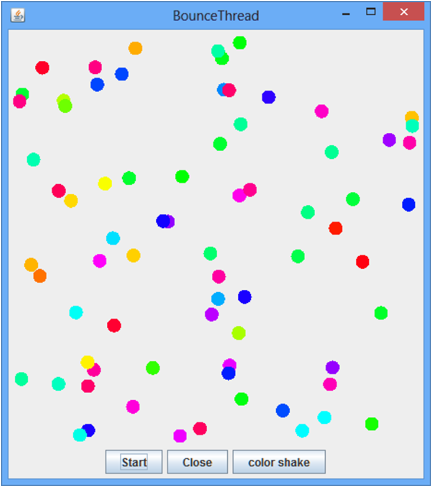
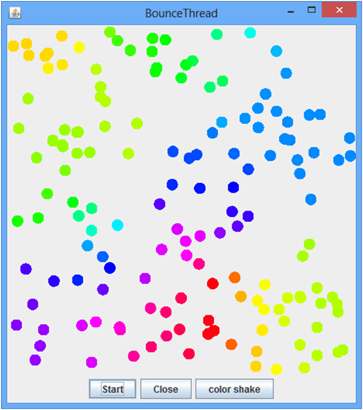
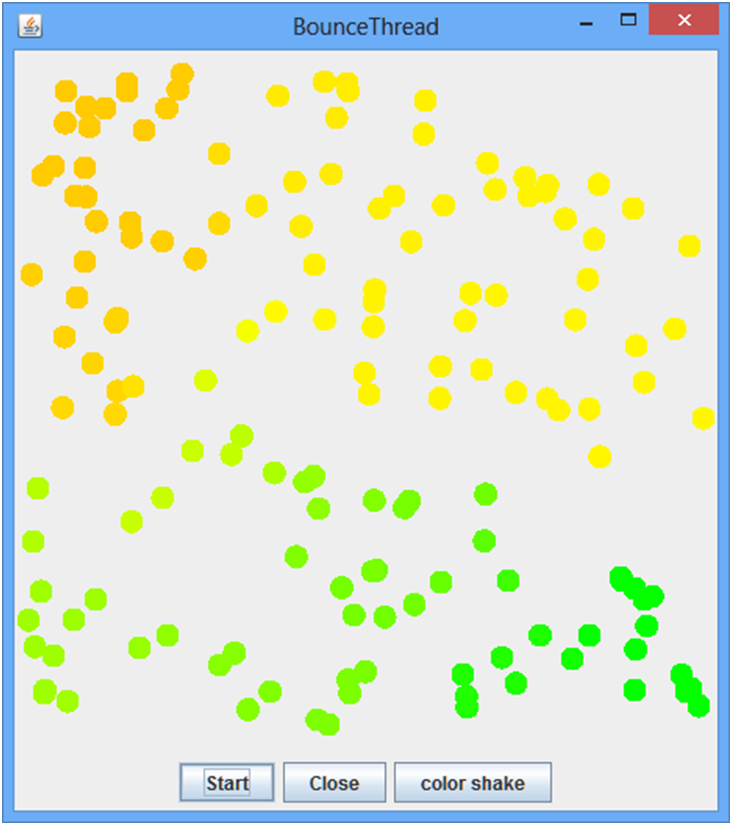
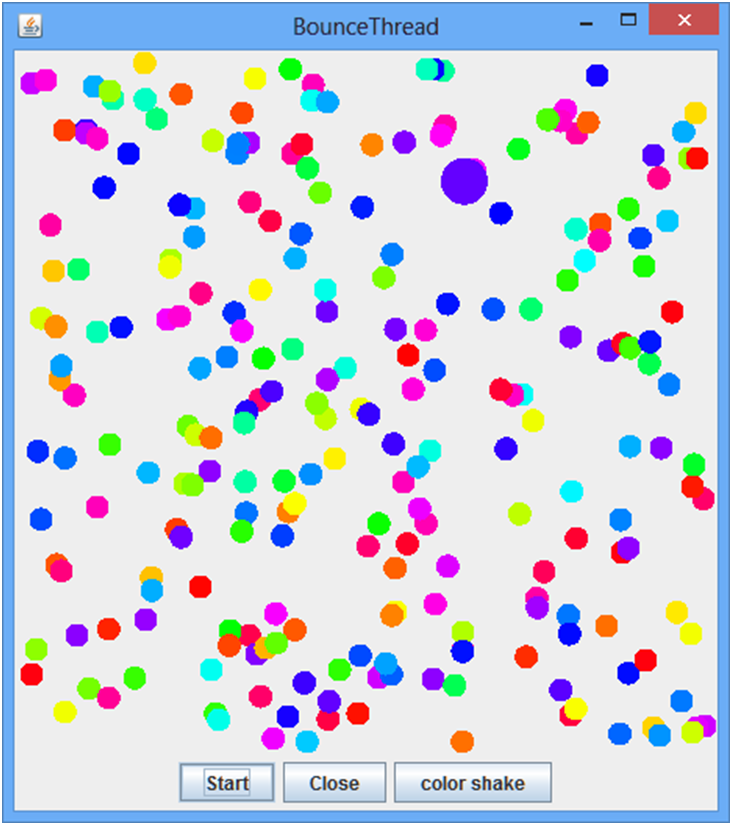
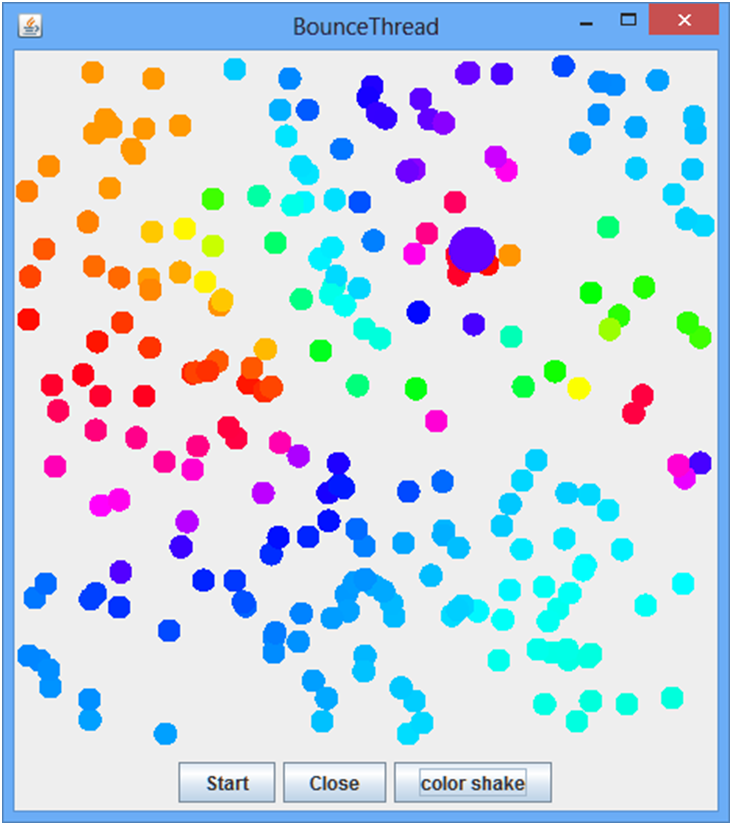
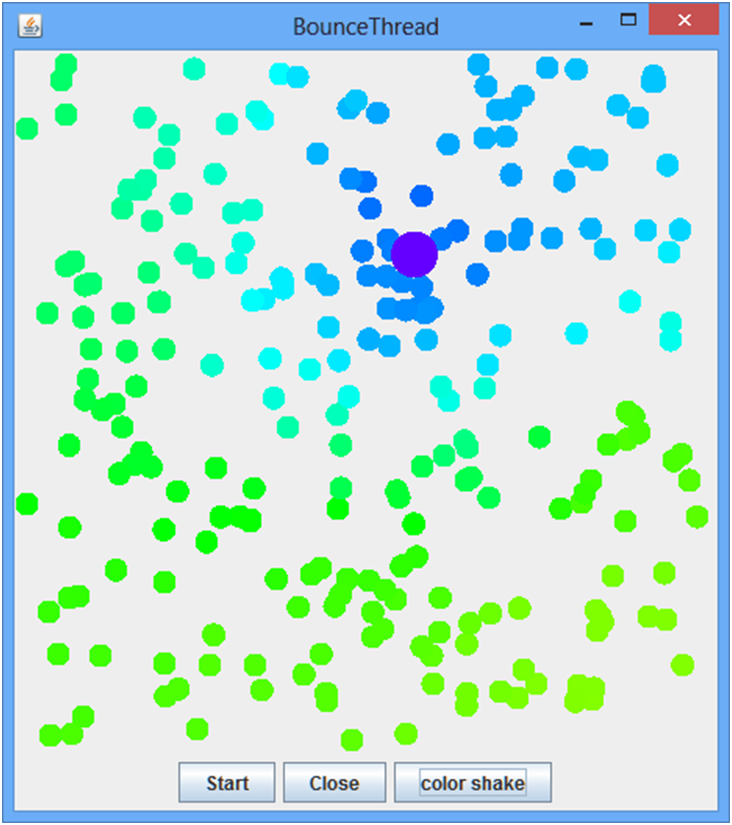
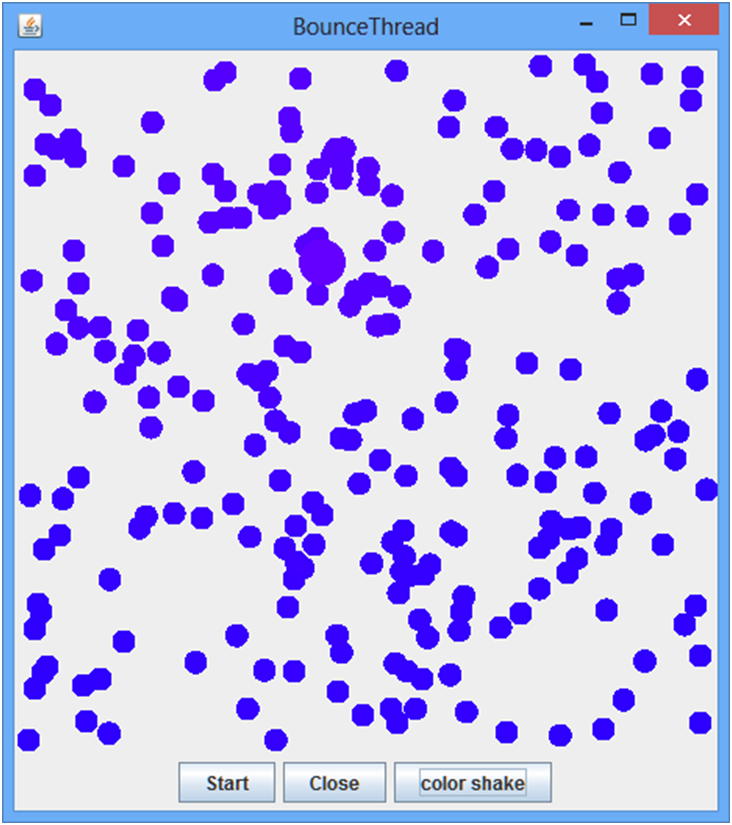

# w_conform
worlds project

броуновские частицы изначально случайных цветов
в дальнейшем каждая точка принимает средний цвет ближайших соседей

идея конформизма - быть подобным окружающим

более крупная точка свой цвет не меняет("убеждённая")

интересный эффект через некоторое время: радужные волны прокатываются по экрану перед устаканиванием в один средний цвет

дальнейшие идеи:
1) разная подверженность влиянию окружения
2) наличие нон-конформиста
3) разная способность влиять (неубедительный/харизматик)
